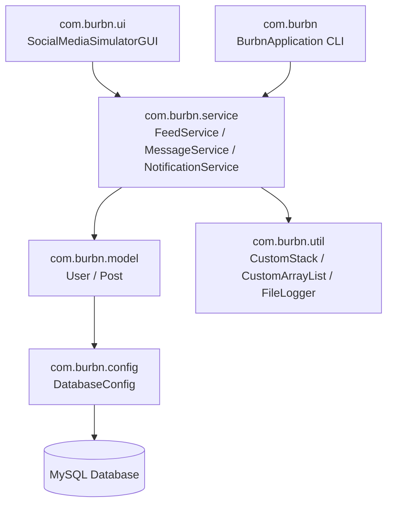

# 📱 Burbn — Social Media Feed Simulator

[](https://www.oracle.com/java/)
[](LICENSE)
[](https://www.mysql.com/)
[]()

> **Burbn** is an enterprise-grade, full-featured Social Media Feed & Interaction Simulator built in Java. It features custom-engineered data structures (Dynamic Array & LIFO Stack), a SQL relational backend, an intelligent feed recommendation algorithm, 24-hour expiring ephemeral stories ("Moments"), direct messaging, thread-safe real-time notifications, and an automated **Aura Points** gamification engine.

---

## 🌟 Resume Highlights & Key Achievements

* **Custom Data Structures & Memory Management**: Designed and implemented custom generic data structures (`CustomStack<T>` & `CustomArrayList<T>`) from scratch without standard Java collection overhead, maintaining efficient $O(1)$ push/pop operations for per-user notification queues.
* **Intelligent Feed Recommendation Engine**: Algorithmically curated user feeds by combining 2-hop mutual connection graphs and overall platform engagement metrics (likes & comments weightings).
* **24-Hour Ephemeral Stories ("Moments")**: Built an expiring post system using SQL timestamp arithmetic (`DATE_ADD`, `INTERVAL 1 DAY`) with interactive emoji reaction dispatching via Direct Messages.
* **Aura Points Gamification Engine**: Formulated a real-time user engagement evaluation formula ($\text{Points} = 10 \times \text{Posts} + 3 \times \text{Comments} + 2 \times \text{Likes}$) with dynamic rank assignment (`👑 Legend`, `🥇 Gold`, `🥈 Silver`, `🥉 Bronze`, `🌱 Beginner`).
* **Dual Interface Support**: Built both an interactive Command Line Interface (CLI) and a Swing Graphical User Interface (GUI) utilizing MVC/Layered architecture principles.

---

## 📐 Architecture & Package Design



### Directory Structure

```
Burbn-SocialMediaSimulator/
├── bin/                          # Compiled bytecode (.class output)
├── data/                         # Local persistence log storage
│   ├── likes.txt
│   ├── notifications.txt
│   ├── posts.txt
│   └── users.txt
├── docs/                         # ER Diagrams & Technical Documentation
├── scripts/                      # 1-Click execution scripts
│   ├── compile.bat
│   ├── run-gui.bat
│   └── run-cli.bat
├── src/
│   └── main/
│       ├── java/
│       │   └── com/
│       │       └── burbn/
│       │           ├── config/   # JDBC Database Connection Lifecycle
│       │           │   └── DatabaseConfig.java
│       │           ├── model/    # User & Post Domain Entities
│       │           │   ├── Post.java
│       │           │   └── User.java
│       │           ├── service/  # Core Business Logic & Feeds
│       │           │   ├── FeedService.java
│       │           │   ├── MessageService.java
│       │           │   └── NotificationService.java
│       │           ├── ui/       # Swing Graphical User Interface
│       │           │   └── SocialMediaSimulatorGUI.java
│       │           ├── util/     # Custom Data Structures & Utilities
│       │           │   ├── CustomArrayList.java
│       │           │   ├── CustomStack.java
│       │           │   └── FileLogger.java
│       │           └── BurbnApplication.java # CLI & Main Entry point
│       └── resources/
│           └── schema.sql        # Database initialization DDL & Seed Data
├── .gitignore
└── README.md
```

---

## 🛠️ Features Breakdown

| Feature | Description | Technical Implementation |
| :--- | :--- | :--- |
| **Authentication & Profiles** | Secure login, registration, active session tracking, and password reset. | Relational `users` table, `HashSet` session lock, SQL prepared statements. |
| **Social Graph & Follows** | Multi-user follow/unfollow capabilities and profile inspections. | Junction table `followers`, dynamic SQL join checks. |
| **Feed & Recommendations** | Main timeline feed display + personalized content recommendations. | Subquery filtering 2-hop mutual network and top engagement counts. |
| **24h Ephemeral Moments** | Expiring content viewable for only 24 hours with emoji quick-react. | MySQL `DATE_ADD(NOW(), INTERVAL 1 DAY)` expiry logic. |
| **Custom Stack Notifications** | Real-time push notifications for likes, follows, comments, and DMs. | Thread-safe `CustomStack<String>` per user. |
| **Direct Messaging (DM)** | Private peer-to-peer messaging and inbox retrieval. | `messages` relational table with timestamped audit trail. |
| **Aura Gamification** | Points and tier badges earned through platform interactions. | Automated calculation routine writing to `users.aura_points`. |

---

## 🗄️ Database Setup (`schema.sql`)

1. Start your local **MySQL Server** (XAMPP, WAMP, or standalone MySQL service).
2. Execute the provided DDL script located at `src/main/resources/schema.sql` via MySQL Workbench, Command Line, or phpMyAdmin:

```sql
CREATE DATABASE IF NOT EXISTS socialmedia;
USE socialmedia;
-- Executing schema.sql will auto-create all tables: users, followers, posts, likes, comments, messages
```

---

## 🚀 How to Build & Run

### Prerequisites
* **Java Development Kit (JDK 17 or higher)**
* **MySQL Database Server** (Running on `127.0.0.1:3306` with user `root`)

### Option A: Using 1-Click Batch Scripts (Windows)

1. **Compile the project**:
   ```cmd
   scripts\compile.bat
   ```

2. **Run Graphical GUI Application**:
   ```cmd
   scripts\run-gui.bat
   ```

3. **Run Interactive Command Line (CLI) Application**:
   ```cmd
   scripts\run-cli.bat
   ```

### Option B: Manual Command Line Execution

```bash
# 1. Compile all Java source files into bin/
javac -encoding UTF-8 -d bin src/main/java/com/burbn/config/*.java src/main/java/com/burbn/util/*.java src/main/java/com/burbn/model/*.java src/main/java/com/burbn/service/*.java src/main/java/com/burbn/ui/*.java src/main/java/com/burbn/*.java

# 2. Run Graphical User Interface (GUI)
java -Dfile.encoding=UTF-8 -cp bin com.burbn.ui.SocialMediaSimulatorGUI

# 3. Run Command Line Interface (CLI)
java -Dfile.encoding=UTF-8 -cp bin com.burbn.BurbnApplication
```

---

## 📝 Resume Project Summary (Ready to Paste)

> **Burbn - Social Media Feed Simulator** *(Java 17, Swing, MySQL, Custom Data Structures, Multithreading)*  
> • Engineered a Java social media simulator implementing custom generic data structures (`CustomStack` & `CustomArrayList`) for $O(1)$ LIFO notification processing.  
> • Developed a feed recommendation engine leveraging 2-hop graph traversal & weighted engagement metrics, along with a 24h ephemeral story system.  
> • Designed a MySQL relational database schema supporting direct messaging, post reactions, user authentication, and real-time Aura Points gamification.  
> • Built dual user interfaces (Swing GUI & Interactive CLI) following clean, modular layered architecture.

---

## 📄 License
Distributed under the MIT License. See `LICENSE` for more information.
